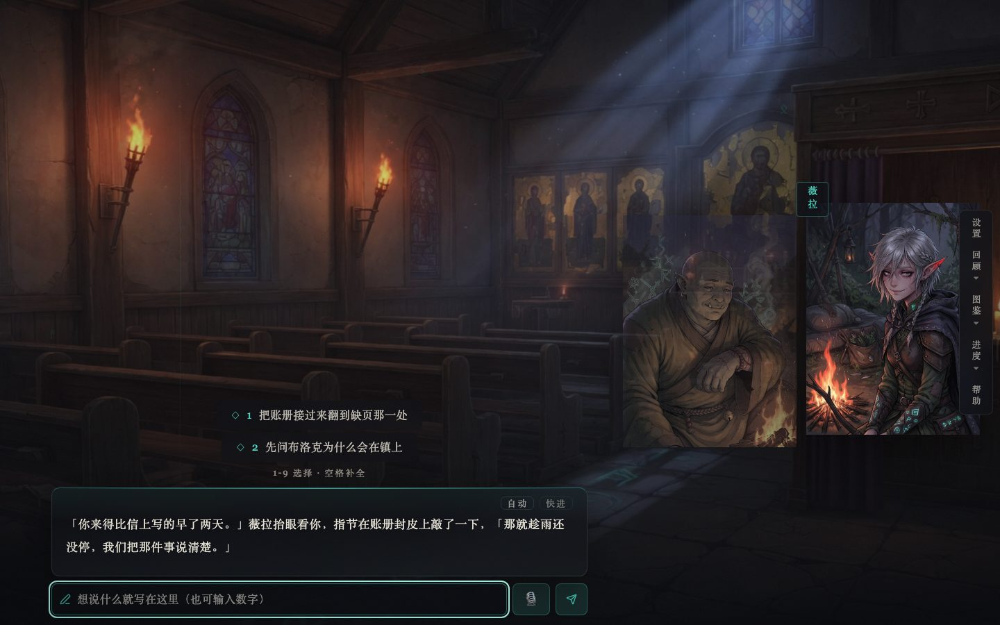
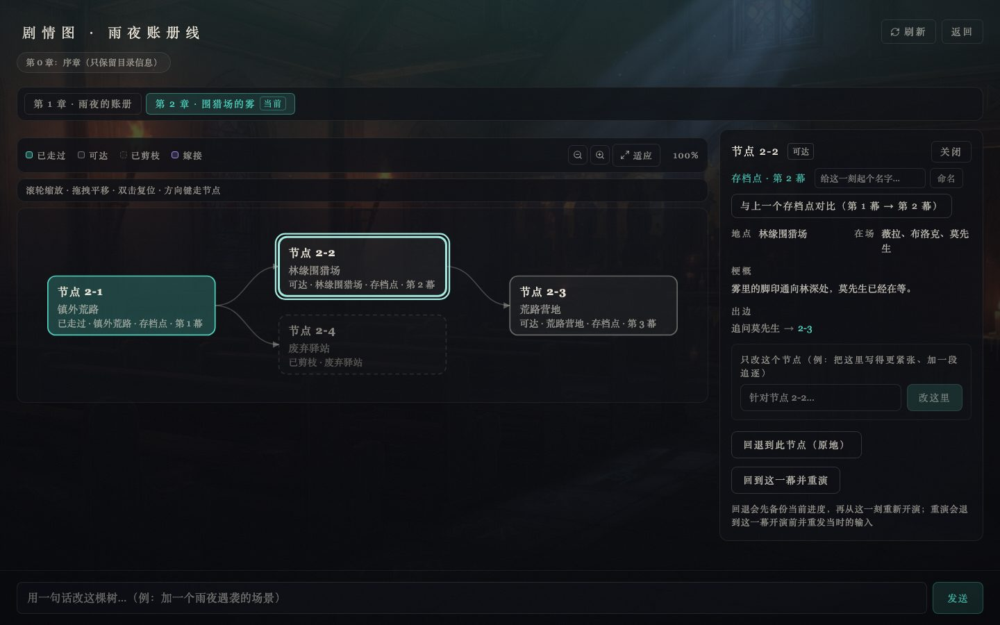
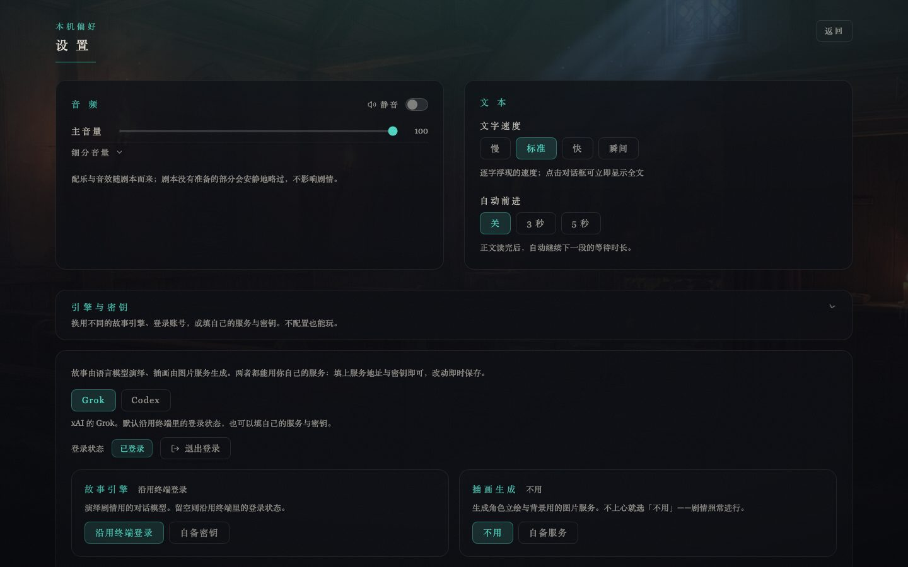

<p align="center"></p>

# bunkiten（分岐点）

<p align="center"><a href="https://github.com/Jackela/bunkiten/actions/workflows/ci.yml"></a> <a href="https://github.com/Jackela/bunkiten/releases"></a> <a href="LICENSE"></a> </p>

> v1.13.0 —— 给单人定制的 LLM 互动 AVG（文字冒险 / 视觉小说）完整产品：Electron 桌面壳 + React 前端 + ACP 叙事引擎；本版把 v1.11–v1.13 三批一次交付——**多引擎后端**（引擎不再只认 grok：设置屏可切 **Codex**，`codex-acp` 随包分发、玩家零安装，登录仍是你终端里那份 ChatGPT 登录态，游戏自己的 `CODEX_HOME` 与玩家的 `~/.codex` 隔离）、**渐进式披露**（命令轨从十项平铺收成 5 个顶层分组、标题屏角落簇收成「素材 / 创作新剧本 / 设置」+「更多 ▾」，菜单有了正经的键盘 Tab 走位；另有一批小而准的功能：存档点命名、重绘带要求、剧情编辑按节点作用域）、**存档点重演**（「重演」不再只认刚走完的那一幕——剧情图里任何一幕都能退回去重发当时的输入，且**你当时说的那句话随存档落盘**：刷新/重启、换台机器导入回来都照样能重演；旧档那几幕会直说「没有留下当时的输入」）。旧存档、旧设置、已存凭据与旧导出包（v1/v2）一律兼容。

一个自包含的游戏：**引擎是 skill**（`.grok/skills/bunkiten/SKILL.md`），**剧本是数据**（`presets/`），**进度是文件**（`state/`），**美术按需生成**（image_gen，按「类型+名字」持久化到当前剧本的 `presets/<id>/assets/`）。AI 实时演绎剧情、画立绘背景，你做选择。每个剧本自带一套主题——配色与氛围图案从标题屏卡带一路贯穿到对话框。

## 一屏看懂

```
启动 → 检查当前引擎的登录态（Codex / grok / 自备密钥，任一条即可）→ 标题屏卡带轮播（← → 切换 · Enter 装载；左下「继续上次」直通最近玩的那条世界线，右下角落簇 素材 / 创作新剧本 / 设置 / 「更多 ▾」（导出当前卡、导入剧本、剧本体检））
     → 世界线屏（每行一个「继续」+ 一个 ⋯ 菜单（改名 / 导出 .world.json / 两段确认删除），右上「新世界线」与「导入」；「家谱」视图把分叉血缘画成森林——谁从哪条线哪个节点分出来一目了然，⌫ = 父线已删，可滚轮缩放 / 拖拽平移）→ 新世界线才去捏主角（或快速开局）→ [制作中：第 1 章大纲 → 按清单逐张生成本章美术（含表情差分，可跳过） | 跳过直接开演] → 开演
每轮：正文（打字机，点对话框或按空格立即显示全文；角色立绘随情绪切换差分）→ 【行动】选项按钮（点按钮或按 1-9）/ 自由输入（含输入选项编号）→ 下一轮；对话框右上角另有两个小控件——「自动」（开自动前进）与「快进」（立即显示全文）；不满意这一掷？命令轨「进度 ▾」菜单里的「重演这一幕」撤销刚走完的这一幕并自动重发同一句输入重新演绎（本世界第一幕除外，可连演；刷新/重启后照样可重演——输入随存档落盘；回想里只留一条分割线，旧幕不删）
声音：引擎每轮可发【曲】/【环境】/【音效】三行——BGM 与环境音各一条通道交叉淡入、音效一次性；文件由作者放在 presets/<id>/audio/，没放就静默
动效：跟随系统「减少动态效果」（prefers-reduced-motion，不新增设置开关——OS 级偏好是用户已做的选择）——位移类动效瞬时化、脉冲光标静止、打字机直接整段显示（淡入淡出保留，属无障碍推荐替代）
章间：本章收束 → 自动进下一章制作（大纲 → 本章全部分支美术）→ 开演，直至终局；跨章时画面正中亮一次「第 N 章」过场（约 2 秒，不拦点击、不抢焦点）
画面：封面卡带 + 背景层 + 角色立绘（差分两级回退）+ 对话框（宽屏时右侧留出立绘宽度，对话框整体左移、不压在立绘上）+ 主题化配色/氛围层；各屏共用一套版式——满幅主题底 + 宽栏 + 统一的面板底与字号档位，不再各屏自写居中小窄栏（外框见 src/components/ShellPage.tsx）；顶栏左上角只在「忙 / 出错 / 待重同步」时现身（状态点 + 玩家口吻的状态文字（忙时带已耗时秒数）+ 世界名 + 重同步徽章），一切正常时整簇收起、把画面还给立绘；章号不在顶栏——它只出现在过场卡与回想抽屉标题上；右侧竖排按钮轨收成 5 个顶层 **设置｜回顾 ▾（历史/前情）｜图鉴 ▾（角色/画廊/剧情图）｜进度 ▾（重演这一幕/重开/换剧本）｜帮助**（高频项一击可达，低频与破坏性项进二级菜单）
剧情图：节点带存档点标注（存档点 · 第 N 幕），可「回退到此节点（原地）」（覆盖该世界线三文件并让引擎重新读档续演）或「回到这一幕并重演」（退到这一幕开演前、重发当时的输入——任何一幕都能重演，不只是刚走完的那一幕），详情里还能「与上一个存档点对比（第 N 幕 → 第 M 幕）」（当前状态/前情提要/剧情图三个 tab 逐行 diff）；顶部章节切换器列出解析出的每一章，点谁画谁（归档章只剩目录信息，点了会直说）；宽屏时节点详情住在右侧栏，窄屏回到画布下方；本章节点 > 40 默认降级为列表（可切回图形）；图形模式滚轮缩放 · 拖拽平移 · 双击复位
画廊：进「选择模式」勾选多张 → 批量重绘（顺序队列）/ 批量删除（两段确认）；封面不参与删除
```

幕后一句话：`grok agent --always-approve --plugin-dir <gameRoot>/.grok stdio`（ACP 协议）做引擎（默认后端是 grok；另一个后端是随包分发的 `codex-acp`，跑在游戏自己的 `CODEX_HOME`，见 [docs/ARCHITECTURE.md](docs/ARCHITECTURE.md) 的「引擎后端」），客户端只渲染正文通道（思考流与工具旁白被架构性过滤）；每会话注入 rules 让引擎输出文本选项，前端解析成按钮；`【图】立绘|角色|images/N.jpg` 标记驱动画面，`【立绘】角色|变体` 行随情绪切换差分立绘；`【曲】`/`【环境】`/`【音效】`三行切换音频（按名字映射到 `presets/<id>/audio/` 里的文件，缺失即静默）；回合推理档默认 medium 提速（`EFFORT` 可调）。

三张实机截图（游戏屏 / 剧情图 / 设置屏），更多见 [docs/images/](docs/images/)：

|  |
|---|
| **游戏屏**：背景层 + 同屏两张立绘（发言者高亮带名牌、非发言者压暗）+ 打字机正文 + 【行动】选项 |

|  |
|---|
| **剧情图**：顶部章节切换器（进度章标「当前」）、节点上的「存档点 · 第 N 幕」、右栏详情（回退 / 回到这一幕并重演 / 只改这个节点） |

|  |
|---|
| **设置屏**：音量与文本偏好 + 「引擎与密钥」（换引擎、登录登出、自备对话与出图服务） |

## 两种运行方式

交付形态只有一种：Electron 桌面应用（MVP 期的终端 TUI 已删除）。下表两列是同一种形态的两种跑法。

> 不想从源码跑？直接下载安装包：[Releases](https://github.com/Jackela/bunkiten/releases)（未签名：macOS 首次打开需右键「打开」，Windows 会有 SmartScreen 提示）。配套的自动更新（electron-updater，打包态启动时查一次）只在**签名构建**上可用——未签名 mac 包装上后不会自动升级（Squirrel.Mac 要求签名一致），想更新就重新下载安装包覆盖安装。

| | 桌面安装包（给朋友） | 开发模式（给自己） |
|---|---|---|
| 启动 | `release/` 产物：Windows `Bunkiten Setup.exe` / portable；mac `.dmg` | `npm run dev:electron`（vite + Electron 并行；纯前端调试可 `npm run dev`，另起 `node server/acp-server.mjs`） |
| 前端来源 | acp-server 同源托管打包产物（`/app`） | vite dev server（proxy → `localhost:7800`） |
| 数据根 | `resources/game/`（asar 外可写） | 项目根 |

玩家侧安装与故障排查见 [QUICKSTART.md](QUICKSTART.md)。

## 快速开始

```bash
git clone https://github.com/Jackela/bunkiten.git
cd bunkiten
npm install
npm run dev:electron
```

> 环境自洽：若你的 shell 导出了 `NODE_ENV=production`，本仓库的 `.npmrc` 会强制安装 devDependencies、`vitest.config.ts` 也会自钉 `NODE_ENV=test`——不需要额外处理。

三步进游戏：克隆 → `npm install` → `npm run dev:electron`。引擎有**三条入场**，任选一条（首启屏与设置屏的「引擎与密钥」里都能改）：

1. **登录 Codex**（v1.11，零安装）：`codex-acp` 随包分发，游戏自己起一个 `CODEX_HOME`（`~/.bunkiten/codex`）与你的 `~/.codex` 隔离；用的还是你终端里那份 ChatGPT 登录态，点一次「登录 Codex」即可（在浏览器里完成，游戏不存你的凭据）。
2. **终端登录 grok**（默认后端）：本机装好 grok CLI 后跑一次 `grok login`。
3. **自备密钥**（v1.10，不碰终端；仅 grok 后端）：点开设置屏（或首启屏的「填自备密钥」）→「引擎与密钥」里填服务地址、密钥、模型名——对话与出图各一组，服务目录里预置了常见服务（OpenAI / Azure / Gemini / Mistral / OpenRouter / DeepSeek / Kimi / 智谱 / 百炼 / SiliconFlow / 火山方舟 / Groq / Together / Fireworks / Grok / 本机 Ollama·LM Studio，以及国内的千帆、混元、星火、MiniMax——同一个服务的国内外站点分列两条，**按你买服务的那个站选**），也可以直接选「自定义」按任意 OpenAI 兼容服务填；改完点「立刻重启引擎」生效。

密钥存在**这台机器上**的 `~/.bunkiten/credentials.json`（目录 0700 / 文件 0600，明文——本机磁盘加密是你的第一道防线），**不进仓库、不进世界线、不进任何导出包**；界面上只显示掩码（`sk-…4f2a`），清空即回落到「沿用终端登录」。填错了/服务方拒绝：对话侧会连不上（设置屏的「测试连接」会告诉你原因），出图失败则静默略过——**剧情照常进行**。

## 本机数据与设置

| 东西 | 在哪 | 说明 |
|---|---|---|
| 进度 | `state/worlds/<worldId>/` | 三份 Markdown（状态 / 前情 / 剧情树）+ `history/` 逐轮快照 + `logs/` 回合原文日志；**不入库**（本机数据），删除先进 `state/trash/` 回收站——手工找回的办法见 [state/README.md](state/README.md) |
| 剧本与美术 | `presets/<剧本 id>/` | 一个目录就是一个自包含的故事：`preset.md` + `assets/` + `audio/` + `cover.jpg`；拷走整个文件夹即可分享，删掉它也就删掉了这个故事的美术 |
| 设置 | 浏览器 `localStorage` 的 `bunkiten.settings.v1` | 主音量 / 静音、文本速度、自动前进这些**本机偏好**；逐键校验兜底默认值，不进世界线、也不随导出包走 |
| 引擎凭据 | `~/.bunkiten/credentials.json`（目录 0700 / 文件 0600） | 自备密钥与所选引擎都存这儿（明文，靠本机磁盘加密）；HTTP 出口一律脱敏，不进日志、快照、回合日志与任何导出包 |

## 写新剧本

复制 `presets/` 下任意子目录改 `preset.md`，无需改代码。frontmatter 必填 `id` / `title`；`# 主要角色` 每人一节（含 `art_prompt`）；`# protagonist_card` 每行 `- 问题: 选项A / 选项B`。这个目录就是这个故事的全部：封面 `cover.jpg` 与运行时生成的立绘/背景（`assets/<类型>-<名字>.jpg`）都落在这里，拷走整个文件夹即可分享，删掉它也就删掉了这个故事的美术。想加声音就再建一个 `presets/<id>/audio/`，文件名按 `<类型>-<名>.<ext>` 放（类型是 `曲` / `环境` / `音效`，扩展名 `mp3` / `ogg` / `m4a` / `wav` / `flac`，例：`曲-雨夜.mp3`、`环境-旅店大堂.mp3`、`音效-门响.wav`）；引擎在场景切换时会发【曲】/【环境】/【音效】行点名播放，名对不上或没放文件就静默跳过——引擎绝不生成音频、也绝不在标记里写路径。也可以不改文件——标题屏右下「创作新剧本」用自然语言和引擎聊出一份新剧本（见 [QUICKSTART.md](QUICKSTART.md)）。完整字段表与消费方说明见 [docs/ARCHITECTURE.md](docs/ARCHITECTURE.md#修改指引)。

**分享剧本（v1.7）**：不用拷文件夹也能分享——标题屏右下角落簇「更多 ▾」里的「导出当前卡」（目标恒为当前中央那张卡）下载一个 `<剧本 id>.preset.json`（preset.md、全部立绘/背景/封面与音频都打在里面，导入单包上限 50MB）；对方点同一个「更多 ▾」里的「导入剧本」选这个文件即可，剧本立刻进轮播。导入遇到重名会自动落成 `<id>-2`，不会覆盖你已有的剧本；包格式与安全规则见 [docs/ARCHITECTURE.md](docs/ARCHITECTURE.md) 的「剧本导出包」一节。

**给剧本体检（v1.7）**：手写或创作模式装配出剧本后，跑 `npm run doctor` 当场检查结构健康度——frontmatter 必填键（id/title 缺失剧本进不了轮播；tagline/genre/rating 缺失只是标题屏栏位为空）与 id=目录名、theme 坏值回退预警（server 与客户端两层判定：`#rrggbb` 6 位 hex、motif 四母题闭集都会被查）、`# 主要角色` 角色节与建议字段（`art_prompt`/`agenda`）、封面（只认 `cover.jpg`，手放成 `.jpeg` 会被点名改名）、`assets/` 与 `audio/` 的文件名契约、孤儿素材（不被任何世界 state.md 引用、也不被任何 preset.md 提及的图）。每个剧本一行小结（`<id> ✓ N 项通过 · M 警告 · K 错误`）加 `[ok]`/`[warn]`/`[error]` 明细；**进程退出码非 0 当且仅当存在 error**（文件名非法、id/title 缺键这类会让剧本进不了轮播或素材永远 404 的问题），warning 只是提示、不影响发布。

## 目录结构

```
bunkiten/
├─ electron/            # Electron 主进程：GAME_ROOT 定位、PATH 补齐、起 acp-server、开窗口、打包态查更新
├─ server/              # 本机 Node 服务（零依赖）：入口 acp-server.mjs + 协议行 / 路由 / ACP / 资产 / 快照 / 世界线 / 音频 / 凭据 / 出图 MCP 模块
├─ shared/              # 唯一真源：协议常量、服务目录、引擎描述符（配手写 .d.mts 供 tsc）
├─ src/                 # React 前端：components/ 各屏、store/ 状态机切片、lib/ 纯函数、theme.ts 主题
├─ .grok/               # 引擎侧加载物：skills/bunkiten/SKILL.md（引擎全部真相）+ commands/（元命令）——只许放这两棵树
├─ presets/             # 剧本数据：一个子目录 = 一个自包含的故事（preset.md + assets/ + audio/ + cover.jpg）
├─ state/               # 运行时进度（不入库）：按世界线分目录，含三文件、逐轮快照、回合日志与索引
├─ scripts/             # 作者侧工具：剧本体检查（doctor）与服务目录发布源生成
├─ tests/               # 单测 + 集成（vitest），以及三套 Playwright e2e（真引擎 / 假引擎 UI / 打包态）
├─ docs/                # ARCHITECTURE.md、adr/（裁决）、releases/（发布说明）、images/（界面截图）、providers.json（发布源）
├─ build/               # 应用图标与 mac 公证 entitlements（electron-builder 的 buildResources）
├─ .github/             # CI 与发版 workflow、issue / PR 模板、dependabot
├─ AGENTS.md            # AI 协作者导航：项目地图 + 契约同步表 + 门禁
├─ CONTRIBUTING.md      # 参与开发：门禁、契约同步、版本号同步点、PR 纪律
├─ CHANGELOG.md         # 逐版沿革（升序）
├─ QUICKSTART.md        # 玩家侧安装与上手
├─ CONTEXT.md           # 领域词表（改术语先改这里）
├─ SECURITY.md          # 安全政策与漏洞报告渠道
├─ CODE_OF_CONDUCT.md   # 贡献者行为准则
├─ LICENSE              # MIT
└─ package.json         # 依赖与 scripts（版本号同步点）
```

每个文件的具体位置与职责在 `AGENTS.md` 的项目地图与 `docs/ARCHITECTURE.md` 里；`dist/`、`release/`、`test-results*/`、`node_modules/` 是构建与运行时产物，不入库。

## 工程质量

- **单测 + 集成全量 560+ 例**（`npm test`，vitest，秒级）：含假引擎集成层（假 ACP 引擎 + 真 acp-server 子进程）；同一套里还有**契约 lint**，钉住协议常量真源、`RULES` 与引擎 SKILL 的逐字副本、主题白名单与用例数下限——防的是两侧悄悄分叉。
- **假引擎确定性 UI e2e，21 个 spec**（`npm run test:e2e:ui`，Playwright + 真 acp-server + vite，零 token、几十秒）；**打包态冒烟**跨平台（mac `.app` / Windows `win-unpacked`），另有一条 opt-in 的真出图链路。
- **CI**：每次 push / PR 跑构建 + `typecheck:server` + 覆盖率仪器下的全量测试 + 假引擎 UI e2e；`main` 上另有一个 Windows job 真跑打包态冒烟（`packaged-win`）。真引擎冒烟要登录态与真 token，只在开发机按需跑。
- 上面那几张界面图不是手截的：`npm run shots` 用假引擎栈（`tests/e2e-shots/`）按仓库真素材重出一遍，改完界面跑一次就能更新——零 token、不进 CI。
- 要动代码：门禁与「改某句话要同批改哪些文件」见 [CONTRIBUTING.md](CONTRIBUTING.md) 与 [AGENTS.md](AGENTS.md)；每个设计决定为什么这么做见 [docs/adr/](docs/adr/)。

## 文档导航

- 想玩 / 装给朋友：[QUICKSTART.md](QUICKSTART.md)
- 想改代码 / 写剧本 / 接手维护：[CONTRIBUTING.md](CONTRIBUTING.md) + [docs/ARCHITECTURE.md](docs/ARCHITECTURE.md)（文本协议契约一节必读）
- 想知道某个设计为什么这么做：[docs/adr/](docs/adr/)（0001–0023：剧情树骨架、全分支预生成、差分分层、表情由引擎驱动、缓存权威、世界线与分叉、剧情图、资产随故事走、逐轮快照与精确分叉、音频协议、打 tag 即发版、协议单一真源、server 模块化、删除进回收站、回合日志与质量守卫、剧本导出包、a11y 基线、世界线索引 schema 与启动迁移、引擎凭据与自备 key、服务目录随版本更新、引擎 skill 注入、grok 与 Codex 双后端、快照记玩家输入）
- 词表（章节 / 节点 / 世界线 / 分叉 / 差分…）：[CONTEXT.md](CONTEXT.md)
- 每版改了什么：[CHANGELOG.md](CHANGELOG.md)（逐版沿革）与 [docs/releases/](docs/releases/)（各版发布说明）
- 下一步做什么 / 决策清单：[docs/ROADMAP.md](docs/ROADMAP.md)；签名与发版怎么配：[docs/RELEASING.md](docs/RELEASING.md)
- 安全政策与漏洞报告渠道：[SECURITY.md](SECURITY.md)；社区行为准则：[CODE_OF_CONDUCT.md](CODE_OF_CONDUCT.md)
- AI 协作者从 [AGENTS.md](AGENTS.md) 进来

## 内容与责任

本项目是**脚手架 / 引擎**：Electron 桌面壳 + React 前端 + ACP 驱动，仓库提供的是机制而非剧情。随附的 preset 剧本保持全年龄向。玩家接入自己的模型后生成的一切内容，由玩家自己与其所用模型负责——项目不做内容审查，也不对生成内容背书。

## 版本沿革

逐版沿革（v0.1 → v1.13.0，含每一版改了什么）在 **[CHANGELOG.md](CHANGELOG.md)**；每一版的详细发布说明在 [docs/releases/](docs/releases/) 与 [GitHub Releases](https://github.com/Jackela/bunkiten/releases)。
